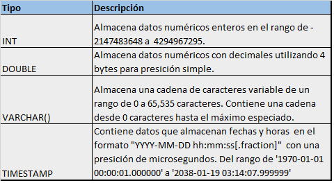
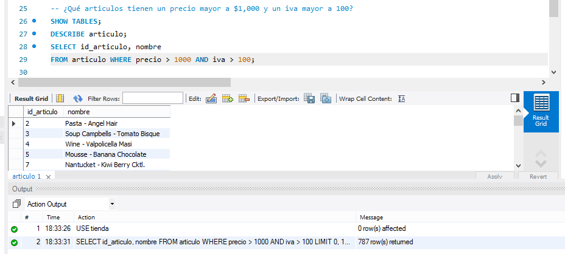
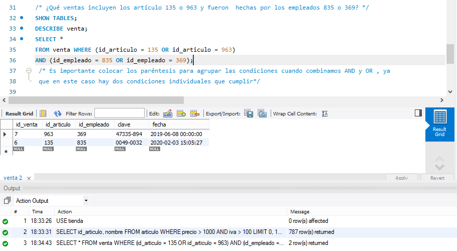
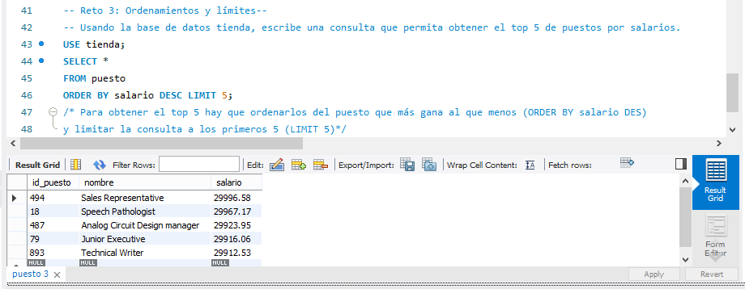

# Sesión1_BEDU: Introducción a SQL. 
El primer paso de esta sesión es realizar la conexión a la base de datos (BD). Para conectarnos al servidor es necesario conocer lo siguiente:
- La dirección del servidor (Host).
- Usuario con el cual nos vamos a conectar.
- Contraseña de acceso. 
- Puerto a través del cual realizaremos la conexión.
Para esto utilizaremos **MySQL Workbench** cuyo puerto es el **3306**.
La solución a los Retos de la sesión 1 se muestran a continuación.
## :pushpin: Reto 1. Estructura de una tabla. 
De las tablas articulo, puesto y venta obtenemos el tipo y descripción por cada dato encontrado.  

## :pushpin: Reto 2. Estructura básica de una consulta.

## :pushpin: Reto 3: Ordenamientos y Límites. 

