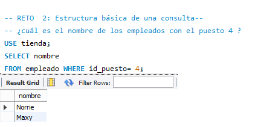
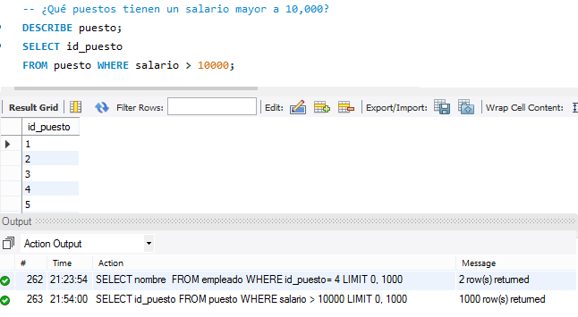

# Sesión1_BEDU: Introducción a SQL. 
La solución a los Retos de la sesión 1 se muestran a continuación.
# Reto 1. Estructura de una tabla. 
De las tablas articulo, puesto y venta obtenemos el tipo y descripción por cada dato encontrado.  
# Reto 2. Estructura básica de una consulta.

